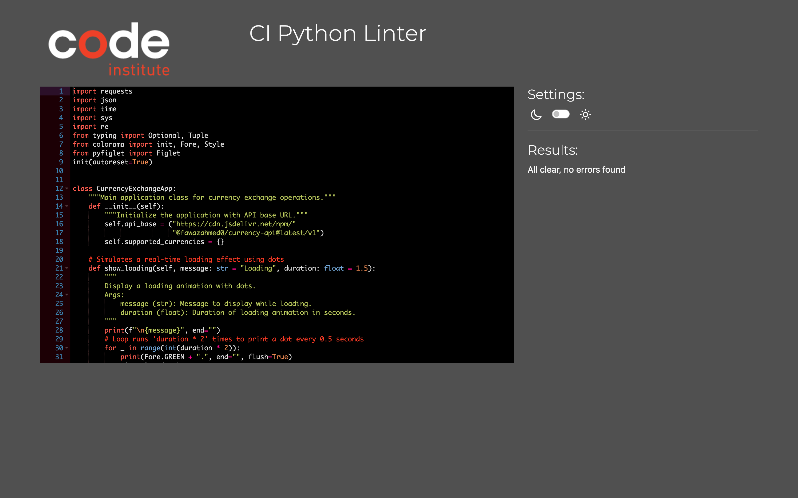

# Currency Exchange CLI Application

Welcome to the Currency Exchange CLI — a Python-based terminal application that enables users to check exchange rates, convert currencies, and explore supported currency codes using real-time data via the Fawaz Ahmed Currency API.

[Live Demo 🔗](https://currency-converter-cli-fad75cd3b79c.herokuapp.com/)


---

## Table of Contents
- [Overview](#overview)
- [Real-World Rationale](#real-world-rationale)
- [Features](#features)
- [User Stories](#user-stories)
- [Flowchart](#flowchart)
- [Technologies Used](#technologies-used)
- [How to Run Locally](#how-to-run-locally)
- [Deployment](#deployment)
- [Testing](#testing)
- [Color Palette](#color-palette)
- [Known Issues](#known-issues)
- [Future Enhancements](#future-enhancements)
- [Credits](#credits)

---

## Overview

This CLI project is designed for users who want quick and reliable access to currency conversion tools directly from the terminal. It provides:
- Real-time exchange rate lookups
- Secure and accurate currency conversions
- Robust input validation
- Clean CLI formatting with colorized outputs

The application is optimized for the Code Institute's standard terminal dimensions (80x24), ensuring accessibility and visual consistency.

---

## Real-World Rationale

In today’s global economy, quick access to accurate currency conversion is essential for:
- Digital nomads and freelancers managing international payments
- Students and travelers converting currencies on the go
- Small business owners comparing rates across borders

This app offers a lightweight, no-login alternative to cluttered web tools. With clear CLI output, emoji-enhanced UX, and robust validation, it provides fast and reliable exchange services in a professional format.

---

## Features

- **Currency Conversion** – Convert between any two valid currencies using live rates.
- **Exchange Rate Check** – Instantly view exchange rates.
- **Supported Currencies** – Display a comprehensive list of valid currency codes.
- **Input Validation** – Regex and numeric checks for robust input handling.
- **Same-Currency Check** – Recognizes if user inputs same currency twice and returns early.
- **User-Friendly CLI UX** – Clean menus, colored output, loading animation, and clear prompts.
- **Graceful Error Handling** – Handles API failures, timeouts, and invalid entries.
- **ASCII Art Headers** – Adds personality and engagement to CLI startup and exit.

---

## User Stories 🧑‍💻

- As a user, I want to convert money between currencies easily.
- As a user, I want to view exchange rates quickly without needing a browser.
- As a user, I want clear feedback when I enter something invalid.
- As a user, I want to see which currency codes are valid.
- As a user, I want to avoid repeating operations manually.
- As a user, I want the experience to be professional, fast, and visually intuitive.

---

## Flowchart

To better understand the application's logic and interaction flow:


---

## 🛠 Technologies Used

### Core Language
- [Python 3.12.8](https://www.python.org/)

### Libraries & Frameworks
- `requests` – Fetches live exchange data via API
- `json` – Used for safe handling of response data and exceptions
- `re` – Regex for currency code validation
- `time` – Simulates loading and timestamps
- `sys` – Graceful exit on interrupt/errors
- `typing` – Static type hints (`Optional`, `Tuple`)
- `colorama` – Adds color/styling to terminal output
- `pyfiglet` – Displays large ASCII-style headers for visual UX

### External API
- **[Fawaz Ahmed Currency API](https://github.com/fawazahmed0/currency-api)**
- Reasons it was selected over other APIs:
  - Covers over 300 currency codes at the time of writing this
  - CDN-delivered JSON
  - Crypto and fiat supported
  - No API key required

---

## How to Run Locally

### 1. Clone the Repository
```bash
git clone https://github.com/BlvckKryptonite/currency_converter_cli.git
cd currency_converter_cli
```

### 2. Create a Virtual Environment
- In VSCode: Press Ctrl+Shift+P → "Python: Create Environment"
- Choose: `venv` and select a Python 3.x version

### 3. Install Dependencies
```bash
pip install -r requirements.txt
```

### 4. Run the App
```bash
python3 run.py
```

---

## Deployment

The application is hosted using **Heroku** and is deployed via Code Institute's **mock terminal** integration for CLI apps.

### Deployment Instructions
1. Fork or clone the repo to your GitHub account
2. Log into Heroku and create a new app
3. Set buildpacks to: `python` (first), `nodejs` (second)
4. Link your GitHub repo to the Heroku app
5. Click **Deploy Branch**
6. Click **Open App** to access the deployed terminal

---

## Testing

### Manual Testing

| Feature                    | Test Description                                      | Result  |
|---------------------------|--------------------------------------------------------|---------|
| Exchange Rate Viewing     | Valid/invalid currencies, timeout handling            | Passed  |
| Currency Conversion       | Positive/negative/zero inputs, valid conversions     | Passed  |
| View Supported Currencies | Verified full list from live API                     | Passed  |
| Same-Currency Validation  | Checks if same code used twice and bypasses API      | Passed  |
| Currency Code Validation  | Tests regex match, length, case sensitivity          | Passed  |
| Amount Validation         | Rejection of strings, symbols, zero, negatives       | Passed  |
| Menu Navigation           | Invalid entries re-prompt until correct input        | Passed  |
| Graceful Interruptions    | KeyboardInterrupt exits without traceback            | Passed  |
| CLI Layout                | All text fits 80x24 standard terminal                | Passed  |

### Visual Testing Evidence (Screenshots)

> Below are real screenshots from terminal sessions showing successful interactions with the CLI.

#### 1. Exchange Rate Viewing

 - Input should **always** be 3 letter code.
 - Input handling and helpful hint dsplayed if invalid three letter code is submitted.
 - Invalid entries re-prompt until correct input.


#### 2. Currency Conversion 
- Currency input should always be a valid three letter code.
- Numerical inputs should always be positive.
- Same currency code bypasses the API and displays a message to the user.


- Special characters (e.g "$", "€") are not allowed.
- Rejection of strings, symbols, zero, negatives
- Successful conversion displays sucess message and exact time of conversion ✅


#### 3. Supported Currencies List
- fetches full list of supported currencies from API .
- Displays full list to users.


### Validation & Linters
- [CI's PEP8 Python Validator](https://pep8ci.herokuapp.com/)
- No major errors or warnings remain (all E501 long lines resolved)



---

## Color Palette

The CLI uses a consistent and meaningful color palette via the `colorama` library:

- **Yellow** 🟡 (`Fore.YELLOW`): Used for main headings, borders, and prompts like welcome/goodbye messages
- **Bright Yellow** 🌕 (`Fore.YELLOW + Style.BRIGHT`): Used for emphasis (e.g. API credit)
- **White** ⚪️ (`default text`): Used for standard body messages and instructions
- **Green** 🟢 (`Fore.GREEN`): Used for successful actions, loading animations, confirmations
- **Red** 🔴 (`Fore.RED`): Used for all error messages and invalid input feedback

This design ensures that important information stands out while keeping the interface visually accessible.

---

## Known Issues

- Small delay when Heroku app spins up from sleep
- Mobile terminal emulation may distort layout slightly
- API may lag during high usage or refresh intervals (CDN-based)
- ⚠️ **Heads-up:** This CLI application is optimized for desktop terminal use and performs best in environments with standard terminal dimensions (80x24). While it can technically be run on mobile browsers, some users may experience input delays, slower animations, or minor formatting issues due to limitations in mobile terminal emulation.

---

## Future Enhancements

- Add historical exchange rate lookups
- Track and save conversion history per session
- Cache supported currencies offline for faster reloads
- Integrate tabular display using `tabulate` or `rich`
- Add a full GUI using `Tkinter` or build a Flask front-end
- Add language localization (e.g., French, Spanish, Swahili)
- Implement unit tests using `pytest`

---

## Credits

- **API Provider**: [Fawaz Ahmed Currency API](https://github.com/fawazahmed0/currency-api)
- **ASCII Art Library**: [pyfiglet](https://pypi.org/project/pyfiglet/)
- **Color Formatting**: [colorama](https://pypi.org/project/colorama/)
- **Project Template**: [Code Institute Python Essentials Template](https://github.com/Code-Institute-Org/python-essentials-template)
- **README Review Inspiration**: [Macro Calculator README by josswe26](https://github.com/josswe26/macro-calculator)

---
